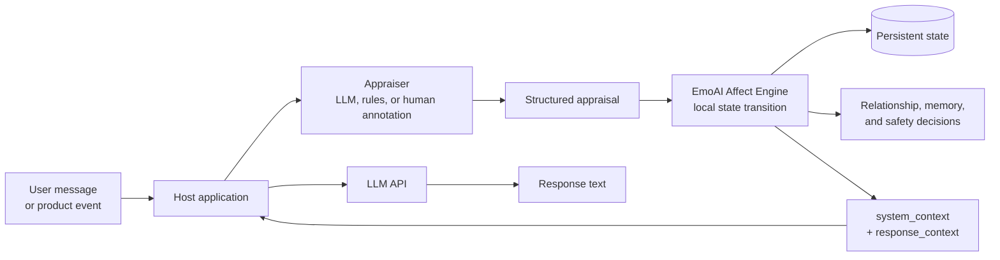

# EmoAI Affect Engine

[中文 README](README.zh-CN.md)

EmoAI Affect Engine is a small, provider-neutral Node.js library for adding a persistent affect state to an LLM application.

It takes a structured appraisal for the current turn and returns:

- updated affect and relationship state;
- memory and safety decisions;
- behavior and expression controls for the next model response;
- prompt fragments that a host application can insert into its model request.

The core engine does not call an LLM and does not classify raw text. Your application supplies the appraisal and decides how to run the model. The repository also includes an optional browser workbench that calls an OpenAI-compatible LLM API, so the complete test setup does have a model API dependency.

## Where it sits in a real application



The engine is the stateful middle layer between appraisal and response generation. It can run without a model API; the host still needs an LLM API if it wants generated responses. Appraisal itself may be produced by a separate LLM call, deterministic rules, or human input.

## When to use it

Use the engine when an application needs affect to persist across turns, for example:

- a character that remembers trust, conflict, repair, or closeness;
- an assistant whose initiative and caution change with the task state;
- a test harness for comparing appraisal inputs and response-control decisions.

It is deliberately not a persona, character, safety policy, provider SDK, or conversation database.

## Quick start

Requirements: Node.js with no external service required for the included checks.

```powershell
npm run smoke
node scripts/regression.js
```

For programmatic use, call `processTurn` and persist the returned `state`:

```js
const { processTurn } = require("./src/runtime");

const result = processTurn({
  conversation_id: "demo",
  input: "The user message or product event",
  appraisal: {
    turn_id: 1,
    valence_level: 1,
    intensity_level: 2,
    relevance_level: 2,
    novelty_level: 1,
    certainty_level: 3,
    controllability_level: 2,
    temporal_orientation: "present",
    primary_target: "shared_task",
    primary_event: "goal_progress",
    primary_event_level: 2
  }
});

// Store result.state and pass it back on the next turn.
// Add result.system_context and result.response_context to the model request.
```

The runtime also reads one JSON payload from stdin and writes one JSON result to stdout, which makes it usable from Python or another host process.

## Browser test workbench

The `frontend/` directory contains a React + MUI workbench for testing an OpenAI-compatible chat endpoint while inspecting the affect result.

```powershell
cd frontend
npm install
npm run dev
```

Open `http://127.0.0.1:5173/`. The first launch asks for the model address/port, model name, and access key. The values are cached in the browser; later launches can start directly. The Vite development server exposes a local `/api/affect` bridge for `src/runtime.js` and a same-origin `/api/chat` proxy for the model endpoint.

## Repository layout

```text
src/
  engine/emoEngine.js          state transitions, relationships, memory, safety
  engine/config.js             event matrices and tunable parameters
  embodiment/embodiedLayer.js  response-control and expression contracts
  affectMarkers.js              optional UI marker selection
  runtime.js                   processTurn and stdin/stdout wrapper
schemas/                       appraisal input schema
docs/                          integration and design documentation
scripts/                       smoke and regression checks
examples/                      minimal host adapter example
frontend/                      browser-based LLM test workbench
```

## Input and output

The appraisal contract is documented in [`docs/APPRAISAL_SPEC.md`](docs/APPRAISAL_SPEC.md), with a machine-readable schema at [`schemas/model_appraisal_prediction.schema.json`](schemas/model_appraisal_prediction.schema.json).

The integration flow is:

1. receive a user turn or product event;
2. produce a structured appraisal outside this package;
3. call `processTurn` with the appraisal and previous state;
4. persist `result.state`;
5. add `result.system_context` and `result.response_context` to the model request;
6. keep persona, task, world, provider, and safety instructions in the host application.

Read [`docs/DESIGN.md`](docs/DESIGN.md) for the state model and transition rules, and [`docs/INTEGRATION.md`](docs/INTEGRATION.md) for host-side prompt placement.

## Scope and limitations

- Appraisal is an input, not an engine output. Use your own classifier, rules, or human annotation.
- Safety fields produce constraints and memory gating; the host remains responsible for enforcement and refusal behavior.
- State persistence, retention policy, provider calls, and product-specific evaluation belong to the host.
- The six neuro-inspired variables are design abstractions, not biological measurements or claims about model consciousness.

## License

MIT. See [`LICENSE`](LICENSE).
