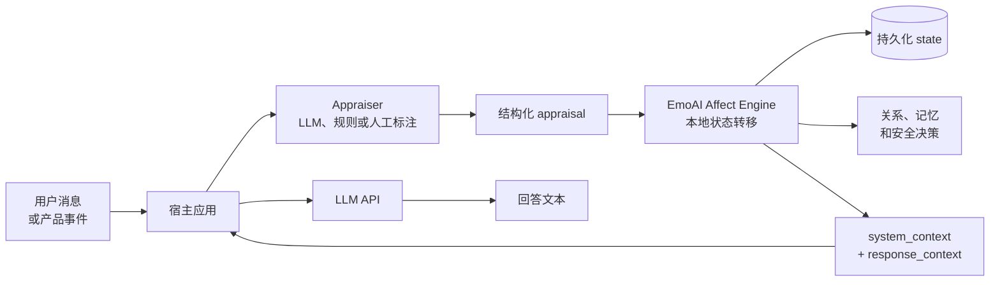

# EmoAI Affect Engine

[English README](README.md)

这是一个与模型供应商无关的 Node.js 情绪状态引擎，用于给 LLM 应用增加可跨轮次持续的 affect（情绪/关系状态）。

它接收当前轮次的结构化 appraisal，返回：

- 更新后的情绪和关系状态；
- 记忆与安全决策；
- 下一轮回答可使用的主动性、谨慎度、亲疏和表达控制；
- 可以插入模型请求的 system/response context。

核心引擎不会直接调用大模型，也不会自行从原始文本分类 appraisal。分类、模型调用和安全策略由宿主应用负责。仓库中的浏览器测试前端会调用 OpenAI-compatible LLM API，因此完整测试环境确实依赖模型接口。

## 它在实际应用中的位置



引擎位于 appraisal 和回答生成之间，是负责跨轮次状态的中间层。它本身可以脱离模型接口运行；但如果宿主要生成自然语言回答，就仍然需要 LLM API。appraisal 也可以来自另一次 LLM 调用、确定性规则或人工输入。

## 快速上手

项目自带检查不需要外部服务：

```powershell
npm run smoke
node scripts/regression.js
```

代码中可以直接调用 `processTurn`：

```js
const { processTurn } = require("./src/runtime");

const result = processTurn({
  conversation_id: "demo",
  input: "用户消息或产品事件",
  appraisal: {
    turn_id: 1,
    valence_level: 1,
    intensity_level: 2,
    relevance_level: 2,
    novelty_level: 1,
    certainty_level: 3,
    controllability_level: 2,
    temporal_orientation: "present",
    primary_target: "shared_task",
    primary_event: "goal_progress",
    primary_event_level: 2
  }
});

// 保存 result.state，在下一轮作为 payload.state 传回。
// 将 result.system_context 和 result.response_context 放入模型请求。
```

`src/runtime.js` 也支持从 stdin 读取一个 JSON、向 stdout 输出一个 JSON，方便 Python 或其他宿主进程调用。

## 浏览器测试前端

`frontend/` 是一个 React + MUI 测试工作台，用于连接 OpenAI-compatible 接口，同时查看 affect 结果。

```powershell
cd frontend
npm install
npm run dev
```

打开 `http://127.0.0.1:5173/`。首次进入填写模型地址/端口、模型型号和 Access Key；配置会缓存在浏览器中，后续可以直接开始对话。Vite 开发服务器提供 `/api/affect` 调用本地引擎，并通过同源 `/api/chat` 转发模型请求。

## 目录说明

```text
src/
  engine/emoEngine.js          状态转移、关系、记忆和安全
  engine/config.js             事件矩阵和可调参数
  embodiment/embodiedLayer.js  回答控制和表达契约
  affectMarkers.js             可选的 UI 表情标记
  runtime.js                   processTurn 与 stdin/stdout 包装
schemas/                       appraisal 输入 schema
docs/                          集成说明和设计文档
scripts/                       smoke 与回归检查
examples/                      最小宿主适配示例
frontend/                      浏览器 LLM 测试工作台
```

## 输入、输出和接入流程

输入字段定义见 [`docs/APPRAISAL_SPEC.md`](docs/APPRAISAL_SPEC.md)，机器可读 schema 在 [`schemas/model_appraisal_prediction.schema.json`](schemas/model_appraisal_prediction.schema.json)。

典型流程：

1. 宿主接收用户消息或产品事件；
2. 在包外生成结构化 appraisal；
3. 传入 appraisal 和上一轮 state，调用 `processTurn`；
4. 持久化 `result.state`；
5. 将 `result.system_context`、`result.response_context` 加入模型请求；
6. 在宿主中继续提供 persona、任务、世界、模型供应商和安全策略。

状态模型和转移规则见 [`docs/DESIGN.md`](docs/DESIGN.md)，提示词放置和宿主职责见 [`docs/INTEGRATION.md`](docs/INTEGRATION.md)。

## 边界

- appraisal 是输入，不是本引擎对原始文本的分类结果；
- 安全字段只提供约束和记忆门控，拒答与策略执行仍由宿主负责；
- 状态存储、保留策略、模型调用和产品评估不属于本项目；
- 六个 neuro-inspired 变量是工程抽象，不是生物测量，也不代表模型具有意识或真实感受。

## 许可证

MIT，见 [`LICENSE`](LICENSE)。
